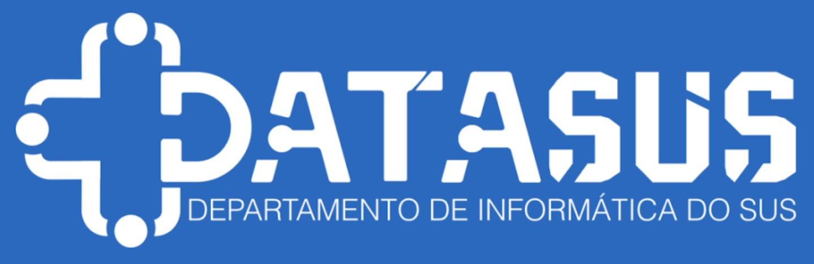

# DATASUS

#  Análise Exploratória sobre a evolução dos leitos hospitalares no Estado de Goiás durante a pandemia de COVID-19.
O projeto a seguir trata-se de uma análise sobre os leitos hospitalares no estado de Goias, obtidos a partir do repositório DATASUS.

    

     

## 1. Sobre o DATASUS

O DATASUS (Departamento de Informática do Sistema Único de Saúde) é um órgão do governo brasileiro responsável por gerenciar e promover a informatização dos serviços de saúde no país. O orgão atua como uma central de dados para a saúde, coletando e armazenando informações sobre o sistema de saúde brasileiro, incluindo dados de registro de doenças, procedimentos médicos, medicamentos e outros, disponibilizando esses dados para pesquisadores, profissionais de saúde e outros interessados em utilizá-los para fins de análise e estudo. Além disso, o DATASUS também oferece serviços e ferramentas online para ajudar a promover a qualidade e a eficiência dos serviços de saúde no país.
      
    
### 1.1 O problema de negócio
    
O projeto foi desenvolvido para avaliar a evolução da capacidade hospitalar (leitos) no Estado de Goiás durante a pandemia de COVID-19, entendendo a distribuição de leitos diante do período obtido. A partir dessas análises servirá de base para possíveis cenários do ano de 2023, visto que o número de casos tende a aumentar com a nova onda presente. Abaixo pontos que devem ser esclarecidos pela análise:
    - Distribuição geográfica dos leitos por municipio antes e depois da pandemia;
    - Evolução do número de leitos no período;
    - Observar a se em algum momento houve declínio da capacidade hospitalar instalada;
    - Comparar a quantidade de leitos SUS e não SUS durante o período;
    - Previsão de leitos para o ano de 2023.
  
    
### 1.2. Base de dados
    
Os dados foram obtidos através da biblioteca microdatasus[1], observando o período de Janeiro de 2019 a Novembro de 2022, para entender como estava a capacidade hospitalar do Estado de Goias antes da descoberta do nCoV-2019 em Dezembro de 2019, ocorridos registros na China, até Novembro de 2022 ano em que os casos começaram a diminuir.  
    
1. SALDANHA, Raphael de Freitas; BASTOS, Ronaldo Rocha; BARCELLOS, Christovam. Microdatasus: pacote para download e pré-processamento de microdados do Departamento de Informática do SUS (DATASUS). Cad. Saúde Pública, Rio de Janeiro , v. 35, n. 9, e00032419, 2019 . Available from http://ref.scielo.org/dhcq3y.
      

Variáveis originais do dataset:
    
    Abaixo o dicionário de dados, de acordo com a documentação presente no site ftp://ftp.datasus.gov.br/dissemin/publicos/CNES/200508_/doc/IT_CNES_1706.pdf.
     

| SEQ | CAMPO | TIPO E TAM | DESCRIÇÃO |
|-----|-------|------------|-----------|
| 1 | CNES | CHAR (7) | Número nacional do estabelecimento de saúde |
| 2 | CODUFMUN | CHAR (6) | Código do município do estabelecimento UF+ MUNIC (sem dígito)
| 4 | REGSAUDE | CHAR (6) | Código da região de saúde
| 5 | MICR_REG | CHAR (4) | Código da micro-região de saúde
| 6 | DISTRSAN | CHAR (4) | Código do distrito sanitário
| 7 | DISTRADM | CHAR (1) | Código do distrito administrativo
| 8 | PF_PJ | CHAR (1) | Indicador de pessoa: 1-Física 3-Jurídica
| 9 |CPF_CNPJ | CHAR (14) | CPF do Estabelecimento, caso pessoa física OU CNPJ, caso pessoa jurídica
| 10 | NIV_DEP | CHAR (1) | Grau de dependência: 1-Individual 3-Mantida
| 11 | CNPJ_MAN | CHAR (14) | CNPJ da mantenedora do Estabelecimento
| 12 | ESFERA_A | CHAR (2) | Código da esfera administrativa
| 13 | ATIVIDAD | CHAR (2) | Código da atividade de ensino
| 14 | RETENCAO | CHAR (2) | Código de retenção de tributos
| 15 | NATUREZA | CHAR (2) | Código da natureza da organização
| 16 | CLIENTEL | CHAR (2) | Código de fluxo da clientela
| 17 | TP_UNID | CHAR (2) | Tipo de unidade (Estabelecimento)
| 18 | TURNO_AT | CHAR (2) | Código de turno de atendimento
| 19 | NIV_HIER | CHAR (2) | Código do nível de hierarquia
| 20 | TERCEIRO | CHAR (1) | O estabelecimento é terceiro: 1-Sim 0-Não
| 21 | TP_LEITO | CHAR (2) | Tipo do LEITO
| 22 | CODLEITO | CHAR (2) | Especialidade do LEITO
| 23 | QT_EXIST | NUMERIC (4) | Quantidade de leitos existentes
| 24 | QT_CONTR | NUMERIC (4) | Quantidade de leitos contratados
| 25 | QT_SUS | NUMERIC (4) | Quantidade de leitos para o SUS
| 26 | QT_NSUS| CHAR(1) | Indicador de EQUIPAMENTO NÃO DISPONÍVEL para o SUS, onde: 1 = SIM 0 = NÃO
| 27 | COMPETEN | CHAR (6) | Ano e Mês de competência da informação (AAAAMM)
| 28 | NAT_JUR | CHAR (4) | Natureza Jurídica

## 2. Estratégia de Solução
O projeto foi desenvolvido através do método CRISP-DM, para atender os seguintes ciclos:

**Ciclo 01:** Análise do número de leitos durante o período de 2019 a 2022, quantidade total de leitos existentes e total de leitos SUS e verificação do declínio ou não da capacidade hospitalar instalada.

**Ciclo 02:** Criar um dashboard do mapa do Estado de Goiás, mostrando a quantidade total de leitos (SUS e não SUS) por município do período de 2019 a 2022.

**Ciclo 03:** Criar uma previsão do número total de leitos que será necessário para os próximos meses do ano de 2023. Para isso, coletar a evolução de casos de COVID-19 do período em que foi descorberto o vírus (Dezembro 2019) a Dezembro de 2022.

